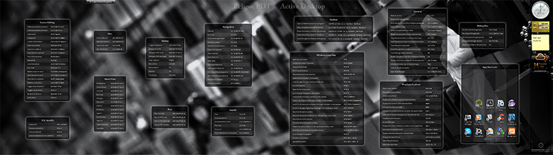

Keyboard Shortcuts on your Desktop
==========================

Get faster, more precise or find alternative ways to accomplish your tasks. Transform your professional and under-utilized desktop background into an asset, essential to your digital production workflow.

#Table of contents

1. Introduction

2. Prerequisites

3. Install

4. Upgrade

5. Modify

6. Contribute

7. Uninstall

8. Legal notices

#Introduction

As a software, internet or digital media professional, your time is of essence. You need to be quick and precise in accomplishing your tasks. That is why in your daily operations you heavily rely on your keyboard.

The software packages and environments you use nowadays however, are huge. Together with their extensions they provide you with multiple ways to accomplish almost anything in your field.

**The only problem is however, if you could remember how.**

When under pressure, gunning for that deadline, you have no time to dwell into manuals, learn new features, let search for keyboard shortcuts. You just blindly run, relying on what you know by heart. But human memory is a tricky thing - it doesn't always play by the rules you may expect. So you stick to the basics, start making errors, and eventually you under-perform.

**The images provided here intend to get you back in track, today.**

Your desktop background is always in your field of vision, regardless whether you work, relax with your favorite game or your attention is away. As a plain image however, your desktop background serves a little purpose. What could you possibly do to utilize that huge empty area on your desktop better?

The images provided here have been prepared with the intention to serve multiple purposes and strike balance on multiple conflicting criteria:

* Stay focused on your task with this enhanced 2.5D arrangement of your desktop.

  * The panoramic background images provided here are desaturated and with reduced contrast, so they take your attention away as little as possible. The predominant low details and smooth gradients together with the visual depth effectively separate these images from everything above.
  
  * On contrary, the applications you use, with their aggressive colors and widgets practically stand out on top of everything. They effectively fix your attention on themselves and on completing your task.
  
  * By being placed on semi-transparent desaturated bases on the one hand, the keyboard shortcuts blend with the panoramic background without compromising the view. On the other hand the crisp, bright monochromatic text is clearly distinguishable from your applications. In this way the keyboard shortcuts unobtrusively "fly" in the middle.
  
  In overall, the clear distinction between panoramic view in the back, shortcuts in the middle and applications in front on the one hand tries to keep you focused on your task, and on the other to allow you to visually switch between layers in a split-second.

* Find quickly what you need by relying on a more effective planar layout.

  * It is practically impossible to fit all shortcuts of all applications on the limited space of a single desktop background. To circumvent this limitation, each of the images provided here refers to a single application environment, and you can switch between them when needed.
  
  * Use your precious time more efficiently. No need to sift through manuals or search the Internet to find how to invoke a specific function. You already have the information you need in front of your eyes, all the time. Just move away the window obstructing the relevant part of your desktop background, or press a single keystroke to minimize them all (Win+D on Windows).
  
  * While trying to incorporate as much information as possible, the design of the images attempts also to elegantly reduce clutter, so you can find what you are looking for on your desktop background, easy.
  
  * Contrary to most user manuals, the emphasis here is on the functions your specific application environment exposes, rather than on keyboard shortcuts. The various functions are further arranged by similarity on task-related logical groups, or attempt to mirror the layout of the widgets of your application environment, so you could find what you need faster.

* Learn on the go. Due to the similarity-based arrangement of the various functions, while visually scrolling through your desktop background seeking the information you need, you can implicitly realize how to accomplish many other similar tasks.

* Promoting a peaceful, calm but creative environment. Regardless its subjectivity, moods and emotions can be rather important topics in establishing an environment that attributes to less errors and higher performance. And that was another reason for selecting panoramic background images like the ones included here.

In summary, instead of being just a plain image of dubious value, your professional desktop background can provide you with the speed, accuracy and cognitive offload you need in order to perform better under pressure.



Screenshot of a Windows 7 desktop having a background image containing the keyboard shortcuts of both Eclipse PDT (left half) and Windows Active Desktop (right half).

To create desktop backgrounds encompassing all display resolutions, multi-monitor layouts, application shortcuts and personal tastes is practically impossible, and this project has such an ambition neither.

The set-up covered by this example project has the following characteristics:

* Horizontal, linear dual 1080p (3840x1080 px) monitor layout

* Desktop background images covering the major keyboard shortcuts for the following applications and environments:

  * [Adebe After Effects](backgrounds/after-effects.png)

  * [Adobe Illustrator](backgrounds/illustrator.png)

  * [Adobe Photoshop](backgrounds/photoshop.png)

  * [Blender](backgrounds/blender.png)

  * [Eclipse IDE with PHP Development Tools](backgrounds/eclipse-pdt.png)

  * [Microsoft OneNote](backgrounds/onenote.png)

  * [Microsoft Windows Active Desktop](backgrounds/active-desktop.png)

The templates included can be used to correct and supplement the shortcuts you need, or incorporate background imagery that appeals to you best.

#Prerequisites

To take maximum advantage of this project, you will need the following software installed:

* Git core client, in order to manage your local copy of the project files:  http://git-scm.com/downloads

* Adobe Illustrator and Adobe Photoshop, in order to use the provided templates

#Install

To install this project on your system, follow these steps:

1. Grab a copy of the project repository and place it in an appropriate local folder. On Windows 7 for example, execute in Command Prompt:

```
git clone https://github.com/bogomirov/keyboard-shortcuts.git ^
%USERPROFILE%\AppData\Local\keyboard-shortcuts
```

2. Enable any or all of the desktop backgrounds. On Windows 7 navigate to:

```
Start -> Control Panel -> Personalization -> Desktop Background
```

and browse to the folder where are the background images, as installed above:

```
C:\users\<your-user-name>\AppData\Local\keyboard-shortcuts\backgrounds
```

3. Select any or all of the desktop backgrounds and adjust the timing of their appearance to your liking.

4. Press `Save changes`

5. Optionally, save the desktop theme under a new name.

From now on, you can switch desktop backgrounds with respect to the application you use. On Windows 7, right-click on an empty area on your Desktop and choose `Next desktop background`.
 
If you are satisfied with what you get and never plan to make any modifications to the design and content of the background images, you can conserve some disk space by removing the templates. On Windows, execute in Command Prompt:

1. Switch to the location of the keyboard shortcuts repo:

```
cd %USERPROFILE%\AppData\Local\keyboard-shortcuts
```

2. Remove the templates from your working tree and index:

```
git rm -r templates
```

3. Commit the changes to your local repo:

```
git commit -am "Removed the templates dir, not planning to make any customizations"
```

In this way the templates will never re-appear in the installation directory whether you make subsequent upgrades or merges. This action is reversible however, whenever you choose to.

#Upgrade

You can upgrade your local copy of the project with the last changes in the remote repository pretty easily. On Windows 7 execute in Command Prompt:

1. Switch to the folder where you have installed your local copy:

```
cd %USERPROFILE%\AppData\Local\keyboard-shortcuts
```

2. Pull the latest changes:

```
git pull origin master
```

3. Verify that the backgrounds you like are still available to your theme by navigating to:

```
Start -> Control Panel -> Personalization -> Desktop Background
```

#Modify

Modifying the desktop backgrounds provided by the project is pretty straightforward.

1. Use the Adobe Photoshop templates to generate raster background images with the exact size of your full desktop.

  Keep in mind that to achieve the effect intended by this project, the images should be of low contrast and desaturated. Whether they are bright or dark is to your liking but ensuring low contrast is important.

2. Export the background images from Photoshop as an intermediary `.png`

3. Open the Adobe Illustrator template and link externaly the new intermediary `.png` images you exported from Photoshop

4. Make the changes you need to the shortcuts content or their layout

5. Export the so composited layers as `.png` images into the project's `backgrounds` directory

6. Delete the intermediary `.png` images you exported from Photoshop

7. As above, ensure the new background images are available to your desktop theme

Do not forget to store the changes you made to the project files into the local repository. In this way you can switch back and forth between modifications, protect against accidental file loss, recover errors, etc. On Windows, execute in Command Prompt:

1. Switch to the location where you have installed the keyboard shortcuts repo:

```
cd %USERPROFILE%\AppData\Local\keyboard-shortcuts
```

2. Commit the changes you have made, adding a relevant descriptive comment, e.g.:

```
git commit -am "Created a new background image for my other application"
```

If, at this point and onwards you would like to incorporate in your local modifications also updates coming from the original repository (see the Upgrade section), please keep in mind that the vector and raster templates distributed with this project are in binary format. There is no version control system yet capable to assist you in merging changes in such content.

When receiving updates therefore, you should keep both copies - your version of the template file and the new version coming from upstream. Open them side-by-side in Photoshop or Illustrator, and attempt to transfer any modifications to your version manually.

For more information on binary merges, see the free on-line book about version control with Git: http://git-scm.com/book

#Contribute

If you would like to share the corrections or additions you have made to the project with the world, you need to complete few steps, similar to the ones outlined in the Bluebird Glx-Dock Theme project: https://github.com/bogomirov/glx-dock-bluebird-theme#contribute

#Uninstall

You can uninstall the keyboard shortcuts project by following few steps. On Windows 7:

1. Ensure that there are no desktop images provided by the project who are currently in use by your desktop theme, or switch to a different theme completely by navigating to:

```
  Start -> Control Panel -> Personalization -> Desktop Background
```

2. Remove the keyboard shortcuts project from your hard drive by executing in Command Prompt:

```
rmdir /s %USERPROFILE%\AppData\Local\keyboard-shortcuts
```

Please note that with this operation you will **irrecoverably delete** all the files associated with the project, together with the history of their modifications. Therefore, if you have made any modifications to the project by yourself, it is advisable to keep a backup copy of your work elsewhere, e.g. by sharing it in on-line.

#Legal notices

All raster imagery used and included in this project is believed to be in the "public domain" and of unknown to the author origin. The author does not intend to infringe any legitimate intellectual right, artistic rights or copyright. If you are the rightful owner of any of the raster images used in this project, and you do not want it distributed, or if you require a suitable credit, then please contact the author of this project to immediately do whatever is needed either for the image to be removed or provide credit where it is due. Please note that all the content of this project is provided free of charge and therefore the author does not gain any financial benefit from its distribution.

Copyright on the project concept, layout design, vector artwork, image processing and composition &copy; 2014, Bogomir Bogomirov.

This project is licensed under a [Creative Commons Attribution 4.0 International License](http://creativecommons.org/licenses/by/4.0/).


